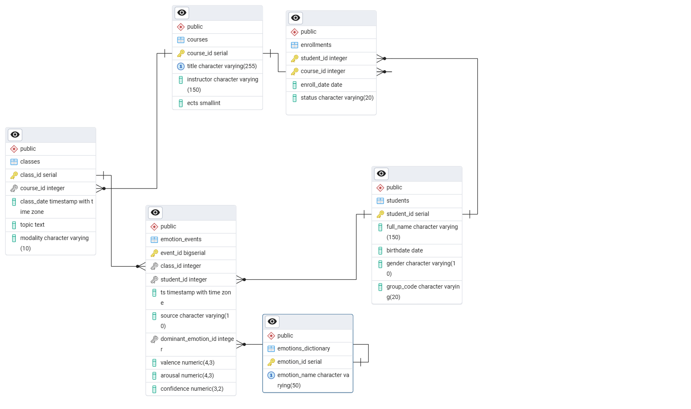
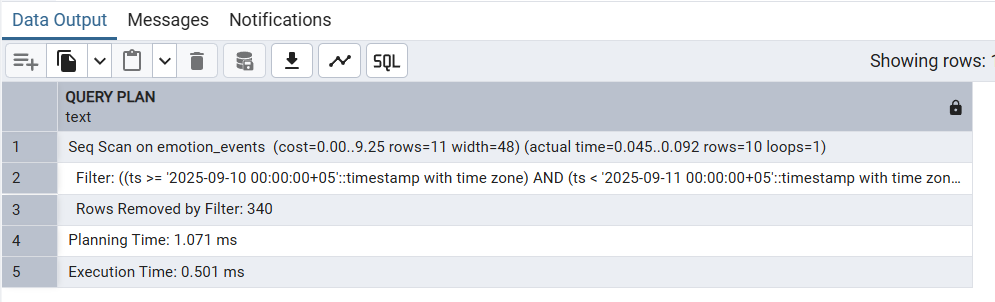
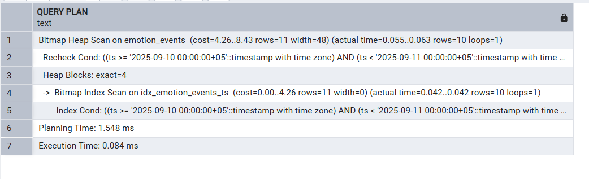

# Relational-DB-for-Learning-Analytics: Анализ Эмоций в Образовании

## 1. Обзор проекта

Проектирование и реализация PostgreSQL базы данных для сбора и анализа данных об **эмоциях студентов** во время учебного процесса. База данных разработана для поддержки аналитики обучения (Learning Analytics).

### 1.1. ER-диаграмма
*ER-диаграмма, иллюстрирующая связи между 6 основными сущностями.*

### 1.2. Структура базы данных (6 таблиц)

1.  `students` - Информация о студентах.
2.  `courses` - Учебные курсы.
3.  `classes` - Конкретные занятия по курсам.
4.  `enrollments` - Записи студентов на курсы (связь "многие-ко-многим").
5.  `emotion_events` - Факты фиксации эмоциональных событий на занятиях.
6.  `emotions_dictionary` - Справочник эмоций (например, радость, скука, удивление).

---

## 2. Описание нормализации (3НФ)

База данных спроектирована по правилам **Третьей нормальной формы (3НФ)** для минимизации избыточности и обеспечения целостности данных.

| Нормальная форма | Суть правила | Пример (Таблица) |
| :--- | :--- | :--- |
| **1НФ** | Атомарность: Каждая ячейка содержит только одно значение. | У студента одно имя в поле `full_name`. |
| **2НФ** | Полная функциональная зависимость: Неключевые поля зависят от **всего** первичного ключа. | В `enrollments` поле `enroll_date` зависит от связки (`student_id` + `course_id`). |
| **3НФ** | Отсутствие транзитивной зависимости: Неключевые поля не зависят от других неключевых полей. | В `courses` имя преподавателя (`instructor`) зависит только от ключа (`course_id`), а не от названия курса. |

---

## 3. Обоснование индексов и оптимизация запросов

Для ускорения аналитических запросов, особенно тех, что связаны с временными рядами, был создан индекс на самой большой таблице — **`emotion_events`**.

### 3.1. Созданный индекс

| Назначение | Поле | Тип индекса |
| :--- | :--- | :--- |
| **Для фильтрации по времени** | `ts` (timestamp) | B-Tree (наиболее подходящий для диапазонов) |

### 3.2. Результаты оптимизации

Сравнение выполнения запроса, фильтрующего данные по временному диапазону:

| Метрика | До индекса (Полное сканирование) | После индекса (Использование Bitmap Index Scan) |
| :--- | :--- | :--- |
| **План выполнения** | `Seq Scan on emotion_events` | `-> Bitmap Index Scan on idx_emotion_events_ts` |
| **Время выполнения** | **0.501 мс** | **0.084 мс** |

**Вывод:** Использование индекса на поле `ts` **сократило время выполнения запроса примерно в 6 раз**, что критически важно для оперативной аналитики.

### 3.3. Визуализация планов выполнения

**До индекса (Seq Scan):**

**После индекса (Bitmap Index Scan):**

